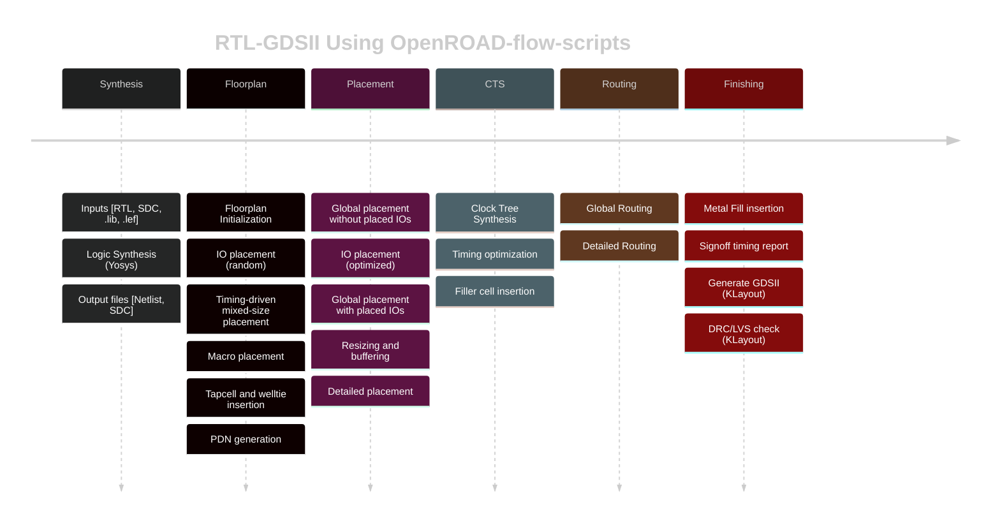

# Tutorial de manejo de Openroad

## Descripción

El proyecto OpenROAD (“Foundations and Realization of Open, Accessible Design”) surge como una iniciativa de DARPA para mejorar el acceso al conocimiento de diseño de semiconductores. 


Este proyecto tiene como objetivo poder convertir un diseño RTL en un GDSII en menos de 24h, sin intervención humana y con métricas de PPA (power/performance/area) adecuadas a la industria.

Estas herramientas pueden se integradas en flujos de trabajo según las necesidades del diseño. A modo de ejemplo el proyecto OpenROAD proporciona un conjunto de scripts que conforman un flujo de trabajo orientado al diseño de sistemas digitales jerárquicos:



Este tutorial usará este flujo de trabajo, si bien no es el único existente. 

OpenROAd ha sido usado también en las siguientes herramientas:
- [OpenROAD-flow-scripts](https://github.com/The-OpenROAD-Project/openROAD-flow-scripts) de [OpenROAD](https://theopenroadproject.org/)
- [OpenLane](https://github.com/The-OpenROAD-Project/OpenLane) de [Efabless](https://efabless.com/)
- [Silicon Compiler](https://github.com/siliconcompiler/siliconcompiler) de [Zero ASIC](https://www.zeroasic.com/)
- [Hammer](https://docs.hammer-eda.org/en/latest/Examples/openroad-nangate45.html)  de [UC Berkeley](https://github.com/ucb-bar)
- [OpenFASoC](https://github.com/idea-fasoc/OpenFASOC) de [IDEA-FASoC](https://github.com/idea-fasoc) orientado al diseño de señal mixta

## Instalación
Para la instalación del flujo de trabajo seguiremos las instrucciones del repositorio OpenROAD-flow-scripts. Estas instrucciones permiten generar una imagen con todas las herramientas necesarias sobre el sistema docker.

### Preparación de la máquina host
Como distribución de trabajo se ha usado Ubuntu 24.04, se ha instalado docker y se ha añadido al usuario de la máquina al grupo "docker" para que pueda tener acceso a los comandos.

Dentro de la carpeta HOME del usuario se crea una carpeta de proyectos y dentro una carpeta llamada Proyectos/demo_openroad

``` text
cd ~
mkdir Proyectos/demo_openroad
cd Proyectos/demo_openroad
```

### Descargar las fuentes
Estas instruccione sbuscan obtener la última versón estable del software, si se quiere un release oficial se deberá bajar un TAG del proyecto.

Con el navegador accederemos a la web en github del proyecto [The-OpenROAD-Project/OpenROAD-flow-scripts](https://github.com/The-OpenROAD-Project/OpenROAD-flow-scripts.git). Una vez ahí deberemos buscar el histórico de cambios del software, en la siguiente imagen es la zona resaltada en amarillo:


En el listado de commits veremos que cada uno de los cambios subidos llevan un indicador de resultados del sistema de pruebas automáticas.


Tenemos dos tipos de pruebas:
- 3/x: son pruebas intermedias
- 7/x: pruebas completas que incluyen regeneración del software

Debemos buscar aquella versión más arriba que tenga un valor de 7/7 y esté en verde, esto indica que será la más actual que ha pasado todas las pruebas de regeneración e integración.

A la derecha, y marcado en amarillo en la imagen, veremos un identificador corto asociado a ese commit (6f51ec8 en la imagen), debemos pinchar en el botón con los dos cuadrados y nos copiará en el portapapeles el identificador completo del commit (6f51ec8c93e1edeb3be4d2747894fd28f711f28f en este caso).

Con esta información a mano pasamos a

Desde el directorio anterior vamos a descargar las fuentes y las ajustamos para estar en ese commit exacto:

``` text
cd ~/Proyectos/demo_openroad
git clone https://github.com/The-OpenROAD-Project/OpenROAD-flow-scripts.git
cd OpenROAD-flow-scripts
git checkout 6f51ec8c93e1edeb3be4d2747894fd28f711f28f
```

### Generación de la imagen de OpenROAD
Una vez establecidas las fuentes ejecutamos el script de instalación del sistema:

``` text
./build_openroad.sh
```

El proceso de compilación e instalación es bastante largo, pudiendo requerir de 10/30min dependiendo de la conexión y capacidad de procesamiento del ordenador.

Una vez completado con éxito tendremos una imagen docker que podemos utilizar. Usando comandos de coker podemos obtener la información:

``` text
user@user:~/Proyectos/demo_openroad/OpenROAD-flow-scripts$ docker images
REPOSITORY                          TAG      IMAGE ID       CREATED         SIZE
openroad/flow-ubuntu22.04-builder   8287a5   e3f097c7b632   7 hours ago     4.56GB
openroad/flow-ubuntu22.04-dev       8287a5   5b2edb392ada   7 hours ago     3.26GB
```

Debemos tener a mano el identificador de esta máquina docker (8287a5 en la ejecución anterior). Esto es importante porque si se ejecutan los scripts directamente del sistema OpenROAD, pueden detectar que la máquina local no es la última y se bajará una imagen del hub de docker. Esta imagen es la imagen base usada para generar las aplicaciones, con lo que no tendrá nada más que un sistema Ubuntu sencillo.

Podemos ejecutar el siguiente comando para poder entrar dentro de la máquina docker:

``` text
docker run --rm -it \
           -u $(id -u ${USER}):$(id -g ${USER}) \
           -v $(pwd)/flow:/OpenROAD-flow-scripts/flow \
		   -v /etc/passwd:/etc/passwd:ro \
		   -v /etc/group:/etc/group:ro \
           -e DISPLAY=${DISPLAY} \
           -v /tmp/.X11-unix:/tmp/.X11-unix \
           -v ${HOME}/.Xauthority:/.Xauthority \
           --network host \
           --security-opt seccomp=unconfined \
           openroad/flow-ubuntu22.04-builder:8287a5
```
Este script es similar al descrito en la [documentación](https://openroad-flow-scripts.readthedocs.io/en/latest/user/BuildWithDocker.html) del proyecto, se ha añadido el montaje en solo lectura de los ficheros de passwd y group para poder mantener los permisos de los ficheros entre la máquina docker y el host.

Una vez dentro de esta consola podemos comprobar que las herramientas están instaladas:

``` text
# Ejecutamos el comando para entrar en la imagen de docker
user@user:~/Proyectos/demo_openroad/OpenROAD-flow-scripts$ docker run --rm -it \
           -u $(id -u ${USER}):$(id -g ${USER}) \
           -v $(pwd)/flow:/OpenROAD-flow-scripts/flow \
                   -v /etc/passwd:/etc/passwd:ro \
                   -v /etc/group:/etc/group:ro \
           -e DISPLAY=${DISPLAY} \
           -v /tmp/.X11-unix:/tmp/.X11-unix \
           -v ${HOME}/.Xauthority:/.Xauthority \
           --network host \
           --security-opt seccomp=unconfined \
           openroad/flow-ubuntu22.04-builder:8287a5

# comprobamos que yosys está instalado
user@user:/OpenROAD-flow-scripts$ yosys --version
Yosys 0.51 (git sha1 c4b519022, g++ 11.4.0-1ubuntu1~22.04 -fPIC -O3)

# ajustamos el entorno de trabajo para que las rutas de los comandos sean adecuadas
user@user:/OpenROAD-flow-scripts$ source env.sh 
OPENROAD: /OpenROAD-flow-scripts/tools/OpenROAD

# ejecutamos la consola de openroad
user@user:/OpenROAD-flow-scripts$ openroad 
OpenROAD HEAD-HASH-NOTFOUND 
Features included (+) or not (-): +GPU +GUI +Python
This program is licensed under the BSD-3 license. See the LICENSE file for details.
Components of this program may be licensed under more restrictive licenses which must be honored.
warning: `/home/user/.tclsh-history' is not writable.
openroad>
```

Para salir de la consola de OpenROAD se debe ejecutar el comando 'exit'. Siempre que se entre dentro del sistema docker es necesario ajustar el entorno para que las herramientas se reconozcan correctamente.

``` text
user@user:/OpenROAD-flow-scripts$ source env.sh 
OPENROAD: /OpenROAD-flow-scripts/tools/OpenROAD
```