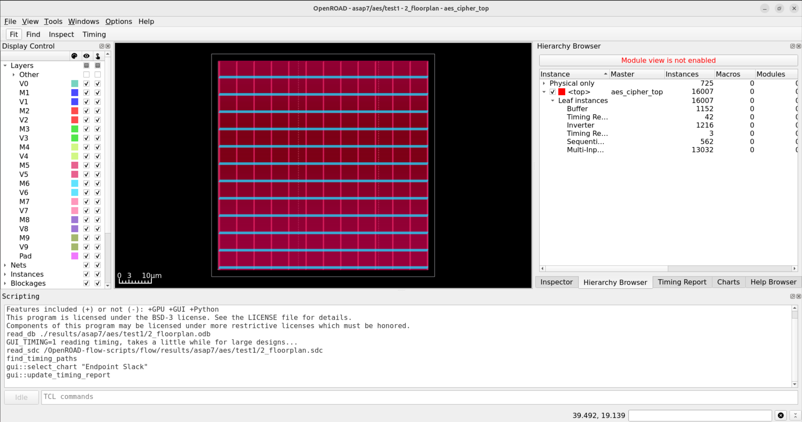

# Tutorial de manejo de Openroad

## Descripción

El proyecto OpenROAD (“Foundations and Realization of Open, Accessible Design”) surge como una iniciativa de DARPA para mejorar el acceso al conocimiento de diseño de semiconductores. 


Este proyecto tiene como objetivo poder convertir un diseño RTL en un GDSII en menos de 24h, sin intervención humana y con métricas de PPA (power/performance/area) adecuadas a la industria.

Estas herramientas pueden se integradas en flujos de trabajo según las necesidades del diseño. A modo de ejemplo el proyecto OpenROAD proporciona un conjunto de scripts que conforman un flujo de trabajo orientado al diseño de sistemas digitales jerárquicos:


Este tutorial usará este flujo de trabajo, si bien no es el único existente. 

OpenROAd ha sido usado también en las siguientes herramientas:
- [OpenROAD-flow-scripts](https://github.com/The-OpenROAD-Project/openROAD-flow-scripts) de [OpenROAD](https://theopenroadproject.org/)
- [OpenLane](https://github.com/The-OpenROAD-Project/OpenLane) de [Efabless](https://efabless.com/)
- [Silicon Compiler](https://github.com/siliconcompiler/siliconcompiler) de [Zero ASIC](https://www.zeroasic.com/)
- [Hammer](https://docs.hammer-eda.org/en/latest/Examples/openroad-nangate45.html)  de [UC Berkeley](https://github.com/ucb-bar)
- [OpenFASoC](https://github.com/idea-fasoc/OpenFASOC) de [IDEA-FASoC](https://github.com/idea-fasoc) orientado al diseño de señal mixta

## Instalación
Para la instalación del flujo de trabajo seguiremos las instrucciones del repositorio OpenROAD-flow-scripts. Estas instrucciones permiten generar una imagen con todas las herramientas necesarias sobre el sistema docker.

### Preparación de la máquina host
Como distribución de trabajo se ha usado Ubuntu 24.04, se ha instalado docker y se ha añadido al usuario de la máquina al grupo "docker" para que pueda tener acceso a los comandos.

Dentro de la carpeta HOME del usuario se crea una carpeta de proyectos y dentro una carpeta llamada Proyectos/demo_openroad

``` text
cd ~
mkdir Proyectos/demo_openroad
cd Proyectos/demo_openroad
```

### Descargar las fuentes
Estas instruccione sbuscan obtener la última versón estable del software, si se quiere un release oficial se deberá bajar un TAG del proyecto.

Con el navegador accederemos a la web en github del proyecto [The-OpenROAD-Project/OpenROAD-flow-scripts](https://github.com/The-OpenROAD-Project/OpenROAD-flow-scripts.git). Una vez ahí deberemos buscar el histórico de cambios del software, en la siguiente imagen es la zona resaltada en amarillo:


En el listado de commits veremos que cada uno de los cambios subidos llevan un indicador de resultados del sistema de pruebas automáticas.


Tenemos dos tipos de pruebas:
- 3/x: son pruebas intermedias
- 7/x: pruebas completas que incluyen regeneración del software

Debemos buscar aquella versión más arriba que tenga un valor de 7/7 y esté en verde, esto indica que será la más actual que ha pasado todas las pruebas de regeneración e integración.

A la derecha, y marcado en amarillo en la imagen, veremos un identificador corto asociado a ese commit (6f51ec8 en la imagen), debemos pinchar en el botón con los dos cuadrados y nos copiará en el portapapeles el identificador completo del commit (6f51ec8c93e1edeb3be4d2747894fd28f711f28f en este caso).

Con esta información a mano pasamos a

Desde el directorio anterior vamos a descargar las fuentes y las ajustamos para estar en ese commit exacto:

``` text
cd ~/Proyectos/demo_openroad
git clone https://github.com/The-OpenROAD-Project/OpenROAD-flow-scripts.git
cd OpenROAD-flow-scripts
git checkout 6f51ec8c93e1edeb3be4d2747894fd28f711f28f
```

### Generación de la imagen de OpenROAD
Una vez establecidas las fuentes ejecutamos el script de instalación del sistema:

``` text
./build_openroad.sh
```

El proceso de compilación e instalación es bastante largo, pudiendo requerir de 10/30min dependiendo de la conexión y capacidad de procesamiento del ordenador.

Una vez completado con éxito tendremos una imagen docker que podemos utilizar. Usando comandos de coker podemos obtener la información:

``` text
user@user:~/Proyectos/demo_openroad/OpenROAD-flow-scripts$ docker images
REPOSITORY                          TAG      IMAGE ID       CREATED         SIZE
openroad/flow-ubuntu22.04-builder   8287a5   e3f097c7b632   7 hours ago     4.56GB
openroad/flow-ubuntu22.04-dev       8287a5   5b2edb392ada   7 hours ago     3.26GB
```

Debemos tener a mano el identificador de esta máquina docker (8287a5 en la ejecución anterior). Esto es importante porque si se ejecutan los scripts directamente del sistema OpenROAD, pueden detectar que la máquina local no es la última y se bajará una imagen del hub de docker. Esta imagen es la imagen base usada para generar las aplicaciones, con lo que no tendrá nada más que un sistema Ubuntu sencillo.

Podemos ejecutar el siguiente comando para poder entrar dentro de la máquina docker:

``` text
docker run --rm -it \
           -u $(id -u ${USER}):$(id -g ${USER}) \
           -v $(pwd)/flow:/OpenROAD-flow-scripts/flow \
		   -v /etc/passwd:/etc/passwd:ro \
		   -v /etc/group:/etc/group:ro \
           -e DISPLAY=${DISPLAY} \
           -v /tmp/.X11-unix:/tmp/.X11-unix \
           -v ${HOME}/.Xauthority:/.Xauthority \
           --network host \
           --security-opt seccomp=unconfined \
           openroad/flow-ubuntu22.04-builder:8287a5
```
Este script es similar al descrito en la [documentación](https://openroad-flow-scripts.readthedocs.io/en/latest/user/BuildWithDocker.html) del proyecto, se ha añadido el montaje en solo lectura de los ficheros de passwd y group para poder mantener los permisos de los ficheros entre la máquina docker y el host.

Una vez dentro de esta consola podemos comprobar que las herramientas están instaladas:

``` text
# Ejecutamos el comando para entrar en la imagen de docker
user@user:~/Proyectos/demo_openroad/OpenROAD-flow-scripts$ docker run --rm -it \
           -u $(id -u ${USER}):$(id -g ${USER}) \
           -v $(pwd)/flow:/OpenROAD-flow-scripts/flow \
                   -v /etc/passwd:/etc/passwd:ro \
                   -v /etc/group:/etc/group:ro \
           -e DISPLAY=${DISPLAY} \
           -v /tmp/.X11-unix:/tmp/.X11-unix \
           -v ${HOME}/.Xauthority:/.Xauthority \
           --network host \
           --security-opt seccomp=unconfined \
           openroad/flow-ubuntu22.04-builder:8287a5

# comprobamos que yosys está instalado
user@user:/OpenROAD-flow-scripts$ yosys --version
Yosys 0.51 (git sha1 c4b519022, g++ 11.4.0-1ubuntu1~22.04 -fPIC -O3)

# ajustamos el entorno de trabajo para que las rutas de los comandos sean adecuadas
user@user:/OpenROAD-flow-scripts$ source env.sh 
OPENROAD: /OpenROAD-flow-scripts/tools/OpenROAD

# ejecutamos la consola de openroad
user@user:/OpenROAD-flow-scripts$ openroad 
OpenROAD HEAD-HASH-NOTFOUND 
Features included (+) or not (-): +GPU +GUI +Python
This program is licensed under the BSD-3 license. See the LICENSE file for details.
Components of this program may be licensed under more restrictive licenses which must be honored.
warning: `/home/user/.tclsh-history' is not writable.
openroad>
```

Para salir de la consola de OpenROAD se debe ejecutar el comando 'exit'. Siempre que se entre dentro del sistema docker es necesario ajustar el entorno para que las herramientas se reconozcan correctamente.

``` text
user@user:/OpenROAD-flow-scripts$ source env.sh 
OPENROAD: /OpenROAD-flow-scripts/tools/OpenROAD
```

Recomendamos grabar el contenido del comando de ejecución del docker en un script llamado 'docker_gui.sh' para poder ejecutarlo de manera más sencilla.

``` text
user@user:~/Proyectos/demo_openroad/OpenROAD-flow-scripts$ echo docker run --rm -it \
           -u $(id -u ${USER}):$(id -g ${USER}) \
           -v $(pwd)/flow:/OpenROAD-flow-scripts/flow \
                   -v /etc/passwd:/etc/passwd:ro \
                   -v /etc/group:/etc/group:ro \
           -e DISPLAY=${DISPLAY} \
           -v /tmp/.X11-unix:/tmp/.X11-unix \
           -v ${HOME}/.Xauthority:/.Xauthority \
           --network host \
           --security-opt seccomp=unconfined \
           openroad/flow-ubuntu22.04-builder:8287a5 > docker_gui.sh
```

A partir de aquí se va a seguir el siguiente flujo de trabajo:
- Se usará un terminal en el host para editar ficheros, bien usando editores en línea de comandos (vim) o bien usando IDEs gráficos (se indicará con el texto 'host:' al principio de los comandos o con un comentario)
- se usará el terminal en docker para ejecutar los comandos de openROAD (se indicará con el texto 'docker:' al principio de los comandos o con un comentario)

## Descripción de los ficheros del flujo de trabajo

Dentro de la carpeta de ficheros del OpenROAD-flow-scripts tendremos la carpeta 'flow', debemos entrar en ella para inspeccionar los contenidos.

``` text
# Antes de haber ejecutado un flujo de trabajo
host: user@user:~/Proyectos/demo_openroad/OpenROAD-flow-scripts$ cd flow
host: user@user:~/Proyectos/demo_openroad/OpenROAD-flow-scripts/flow$ ls
      BUILD.bazel  designs  Makefile   platforms  scripts  test  tutorials  util

# Después de haber ejecutado un flujo de trabajo
host: user@user:~/Proyectos/demo_openroad/OpenROAD-flow-scripts$ cd flow
host: user@user:~/Proyectos/demo_openroad/OpenROAD-flow-scripts/flow$ ls
      BUILD.bazel  designs  logs  Makefile  objects  platforms  reports  results  scripts  test  tutorials  util
```

Cada una de esas carpetas posee un conjunto de información distinto e importante para los proyectos:

``` text
flow
|---- designs                     <- Carpeta con las fuentes y configuración de cada diseño
      |---- src                   <- Fuentes RTL de varios proyectos
      |---- asap7                 <- Proyectos usando el PDK asap7
            |---- minimal         <- Proyecto de ejemplo
                  |---- config.mk <- fichero de configuración def flujo de trabajo
|---- platforms                   <- PDKs usados pro las herramientas
      |---- asap7                 <- PDK asap7
|---- scripts                     <- Scripts del flujo de trabajo
|---- test                        <- Pruebas de integraciónd e OpenROAD
|---- tutorial                    <- Tutorial
|---- util                        <- Aplicaciones en python para procesar los ficheros de trabajo
```

## Ejecución de flujo de trabajo con Makefile instalado
El flujo de trabajo que proporciona OpenROAD está encapsulado dentro de un Makefile. Ajustando algunas variables de entorno y ejecutando el comando 'make' es posible pasar de un RTL a un GDSII, teniendo la opción de investigar los resultados intermedios del flujo de trabajo.

Este makefile puede ejecutarse paso a paso, incluyendo la inspección de los resultados obtenidos en cada salida.

Primero entraremos el el sistema docker y configuraremos la variable de entorno DESIGN_CONFIG para que apunte a un diseño de ejemplo.

``` text
host:   user@user:~/Proyectos/demo_openroad/OpenROAD-flow-scripts$ sh docker_gui.sh
docker: user@user:/OpenROAD-flow-scripts$ source env.sh 
        OPENROAD: /OpenROAD-flow-scripts/tools/OpenROAD
docker: user@user:/OpenROAD-flow-scripts$ cd flow
docker: user@user:/OpenROAD-flow-scripts/flow$ export DESIGN_CONFIG=./designs/asap7/aes/config.mk
```

Pasamos a relizar la compilación paso a paso del ejemplo.

### Ejecución de síntesis
Ejecutamo make con el target synth, esto lanzará los procesos de "linting" y paso de código HDL genérico a RTL usando las celdas lógicas del PDK.

``` text
docker: user@user:/OpenROAD-flow-scripts/flow$ make synth
```


Una vez ha terminado este proceso con éxito tendremos los ficheros con los resultados:

``` text
docker: user@user:/OpenROAD-flow-scripts/flow$ ls results/asap7/aes/base/1*
        1_1_yosys.v
        1_synth.rtlil
        1_synth.sdc
        1_synth.v
```

Podemos lanzar la GUI para inspeccionar los resultados, si bien en este punto no habrán elementos físicos que inspeccionar.

``` text
docker: user@user:/OpenROAD-flow-scripts/flow$ make gui_synth
```


### Ejecución del floorplan
Ejecutamo make con el target floorplan, esto lanzará el proceso de estimación del espacio físico necesario y generación de las líneas de alimentación.

``` text
docker: user@user:/OpenROAD-flow-scripts/flow$ make floorplan
```


Una vez ha terminado este proceso con éxito tendremos los ficheros con los resultados:

``` text
docker: user@user:/OpenROAD-flow-scripts/flow$ ls results/asap7/aes/base/2*
        2_1_floorplan.odb
        2_1_floorplan.sdc
        2_2_floorplan_macro.odb
        2_2_floorplan_macro.tcl
        2_3_floorplan_tapcell.odb
        2_4_floorplan_pdn.odb
        2_floorplan.odb
        2_floorplan.sdc
```

Los ficheros tcl generados pertenecen a este diseño y han sido a su vez generados por los tcl contenidos en el directorio scripts.

Podemos lanzar la GUI para inspeccionar los resultados. Los ficheros "odb" contienen las bases de datos con los resultados del proceso de floorplan, siendo 2_floorplan.odb el último generado y el que se visualiza con la GUI.

``` text
docker: user@user:/OpenROAD-flow-scripts/flow$ make gui_floorplan
```



Podemos resaltar una de las líneas físicas para ver información en el inspector.


En la zona de la izquierda, en el display control podemos activar o desactivar la visualización de distintos elementos. Por ejemplo podemos desactivar la visualización de las "Nets" de "Power" y "Ground". En este caso nos quedará solo el contorno y los "Welltaps".


### Ejecución del placement
Ejecutamo make con el target place, esto lanzará el proceso de colocación de los elementos lógicos y el I/O de manera optimizada.

``` text
docker: user@user:/OpenROAD-flow-scripts/flow$ make place
```


Una vez ha terminado este proceso con éxito tendremos los ficheros con los resultados:

``` text
docker: user@user:/OpenROAD-flow-scripts/flow$ ls results/asap7/aes/base/3*
        3_1_place_gp_skip_io.odb
        3_2_place_iop.odb
        3_2_place_iop.tcl
        3_3_place_gp.odb
        3_4_place_resized.odb
        3_5_place_dp.odb
        3_place.odb
        3_place.sdc
```

Podemos lanzar la GUI para inspeccionar los resultados. Los ficheros "odb" contienen las bases de datos con los resultados del proceso de place, siendo 3_place.odb el último generado y el que se visualiza con la GUI.

``` text
docker: user@user:/OpenROAD-flow-scripts/flow$ make gui_place
```


En la imagen se ven las celdas lógicas y los I/Os distribuidos en los laterales. Si marcamos que no se vean las Nets de power y ground podemos ver que quedan resaltadas las celdas lógicas.


Haciendo zoom podemos observar las celdas lógicas que se han colocado:


En el menú de visualización, en Instances -> StdCells podemos marcar la visualización de los Buffers, Combinational o Sequential que se han colocado, así veremos la distribución de los mismos.

En este nivel del flujo de trabajo la herramienta ya empieza a generarnos "Heat maps" para mostar de manera gráfica algunas situaciones del diseño que serán importantes para el rendimiento y capacidad de enrutado.

En la configuración de la visualización a la izquierda podemos activar las opciones de "Pin Density", "Placement Density", "Power Density" y "Estimated Congestion (RUDY)". La escala de colores va desde el azul (poca densidad, energía, pines,..) al rojo (posibles problemas de calor, congestión, problemas de rutado,...). Muchos de estos parámetros dependerán de lo estrictas que sean las condiciones de ocupación del espacio y de complimiento de tiempos.


### Ejecución del clock tree synthesis
Ejecutamo make con el target cts, esto lanzará los procesos asociados a la síntesis del árbol de relojes y optimización de colocación de celdas.

``` text
docker: user@user:/OpenROAD-flow-scripts/flow$ make place
```


Una vez ha terminado este proceso con éxito tendremos los ficheros con los resultados:

``` text
docker: user@user:/OpenROAD-flow-scripts/flow$ ls results/asap7/aes/base/4*
        4_1_cts.odb
        4_after_rsz.v
        4_before_rsz.v
        4_cts.odb
        4_cts.sdc
```

Los ficheros verilog indican los cambios en el netlist derivados de la insercción de buffers para poder cumplir los requisitos de timing del árbol de relojes.

Podemos lanzar la GUI para inspeccionar los resultados. Los ficheros "odb" contienen las bases de datos con los resultados del proceso de place, siendo 4_cts.odb el último generado y el que se visualiza con la GUI.

``` text
docker: user@user:/OpenROAD-flow-scripts/flow$ make gui_cts
```


En el menú Windows marcamos la opción Clock Tree Viewer y nos aparecerá una pestaña nueva llamada Clock Tree Viewer (marcado en amarillo en la imagen).


En esa pestaña pulsaremos sobre el botón de update (marcado en amarillo en la imagen) y nos aparecerá tanto el árbol de relojes en la pestaña como su representación sobre el diseño. En este punto el árbol no está rutado con lo que serán conexiones punto a punto.

En la imagen se puede observar en el árbol de relojes el retardo entre el reloj de entrada y cada uno de los puntos a donde llega, este retardo está balanceado y dependerá de los requisitos de reloj y de las constraints de tiempos que se configuren. A la izquierda se puede ver el pad/señal que será el origen del reloj en este diseño.


en los "Heat maps" no hay ninguna actualización importante al haber metido unos pocos elementos lógicos de reparto del reloj.

### Ejecución del routing
Ejecutamo make con el target route, esto lanzará los procesos asociados al rutado local y global.

``` text
docker: user@user:/OpenROAD-flow-scripts/flow$ make route
```


Una vez ha terminado este proceso con éxito tendremos los ficheros con los resultados:

``` text
docker: user@user:/OpenROAD-flow-scripts/flow$ ls results/asap7/aes/base/5*
        5_1_grt.odb
        5_1_grt.sdc
        5_2_route.odb
        5_3_fillcell.odb
        5_route.odb
        5_route.sdc
```

Podemos lanzar la GUI para inspeccionar los resultados. Los ficheros "odb" contienen las bases de datos con los resultados del proceso de place, siendo 5_route.odb el último generado y el que se visualiza con la GUI.

``` text
docker: user@user:/OpenROAD-flow-scripts/flow$ make gui_route
```

En la imagen podemos ver ya rutadas todas las señales del diseño:


Si configuramos la visualización del árbol de relojes (explicado en el apartado de Ejecución del clock tree synthesis) ahora podemos ver estas señales conectadas a los distintos puntos del circuito.


Además en los "Heat Maps" ahora los valores de congestión son más "grandes" por estar las señales rutadas y las celdas ya colocadas en su posición final.


Aquí podemos ver la comparativa entre el proceso de place (izquierda) y el de route (derecha).


### Finalización del porceso de generación del GDSII
Ejecutamo make con el target final, esto lanzará los procesos finales para la generación del GDSII.

``` text
docker: user@user:/OpenROAD-flow-scripts/flow$ make final
```


Una vez ha terminado este proceso con éxito tendremos los ficheros con los resultados del proceso:

``` text
docker: user@user:/OpenROAD-flow-scripts/flow$ ls results/asap7/aes/base/1*
        6_final.gds
        6_1_fill.sdc
        6_final.sdc
        6_final.def
        6_final.v
```

El fichero 6_final.gds es el fichero que contiene el diseño final listo para poder mandarse a la foundry.

Podemos lanzar la GUI para inspeccionar los resultados. Los ficheros "odb" contienen las bases de datos con los resultados del proceso de place, siendo 6_final.odb el último generado y el que se visualiza con la GUI.

``` text
docker: user@user:/OpenROAD-flow-scripts/flow$ make gui_final
```

En la imagen podemos ver ya rutadas todas las señales del diseño:


La interfaz gráfica no nos muestra más información que en pasos anteriores. En los ficheros de reporte y log si aparecen datos sobre la extarcción de parásitos y caídas de tensión.

```text
docker: user@user:~/Proyectos/demo_openroad/OpenROAD-flow-scripts/flow/logs/asap7/aes/test1$ cat  6_report.log
OpenROAD HEAD-HASH-NOTFOUND 
Features included (+) or not (-): +GPU +GUI +Python
This program is licensed under the BSD-3 license. See the LICENSE file for details.
Components of this program may be licensed under more restrictive licenses which must be honored.
[INFO ORD-0030] Using 32 thread(s).
source /OpenROAD-flow-scripts/flow/platforms/asap7/setRC.tcl
Deleted 0 routing obstructions
[INFO RCX-0431] Defined process_corner X with ext_model_index 0
[INFO RCX-0029] Defined extraction corner X
[INFO RCX-0435] Reading extraction model file /OpenROAD-flow-scripts/flow/platforms/asap7/rcx_patterns.rules ...
[INFO RCX-0436] RC segment generation aes_cipher_top (max_merge_res 50.0) ...
[INFO RCX-0040] Final 131468 rc segments
[INFO RCX-0439] Coupling Cap extraction aes_cipher_top ...
[INFO RCX-0440] Coupling threshhold is 0.1000 fF, coupling capacitance less than 0.1000 fF will be grounded.
[INFO RCX-0442] 53% of 137210 wires extracted
[INFO RCX-0442] 100% of 137210 wires extracted
[INFO RCX-0045] Extract 17621 nets, 148853 rsegs, 148853 caps, 215576 ccs
[INFO RCX-0443] 17621 nets finished
[INFO PSM-0040] All shapes on net VDD are connected.
[INFO PSM-0073] Using bump pattern with x-pitch 140.0000um, y-pitch 140.0000um, and size 70.0000um with an reduction factor of 3x.
########## IR report #################
Net              : VDD
Corner           : default
Supply voltage   : 7.70e-01 V
Worstcase voltage: 7.50e-01 V
Average voltage  : 7.64e-01 V
Average IR drop  : 6.49e-03 V
Worstcase IR drop: 2.02e-02 V
Percentage drop  : 2.62 %
######################################
[INFO PSM-0040] All shapes on net VSS are connected.
[INFO PSM-0073] Using bump pattern with x-pitch 140.0000um, y-pitch 140.0000um, and size 70.0000um with an reduction factor of 3x.
########## IR report #################
Net              : VSS
Corner           : default
Supply voltage   : 0.00e+00 V
Worstcase voltage: 2.09e-02 V
Average voltage  : 6.52e-03 V
Average IR drop  : 6.52e-03 V
Worstcase IR drop: 2.09e-02 V
Percentage drop  : 2.72 %
######################################
Cell type report:                       Count       Area
  Fill cell                             19058    2159.30
  Tap cell                                725      21.14
  Buffer                                 1122     256.35
  Clock buffer                             25      10.59
  Timing Repair Buffer                   1118     103.91
  Inverter                               1216      67.96
  Clock inverter                           21       9.14
  Timing Repair inverter                    4       0.31
  Sequential cell                         562     173.30
  Multi-Input combinational cell        13038    1453.20
  Total                                 36889    4255.19
Report metrics stage 6, finish...

==========================================================================
finish report_design_area
--------------------------------------------------------------------------
Design area 2075 u^2 49% utilization.
```

Podemos ver el GDSII generado usando la herramienta klayout:

``` text
docker: user@user:/OpenROAD-flow-scripts/flow$ klayout results/asap7/aes/test1/6_final.gds
```

