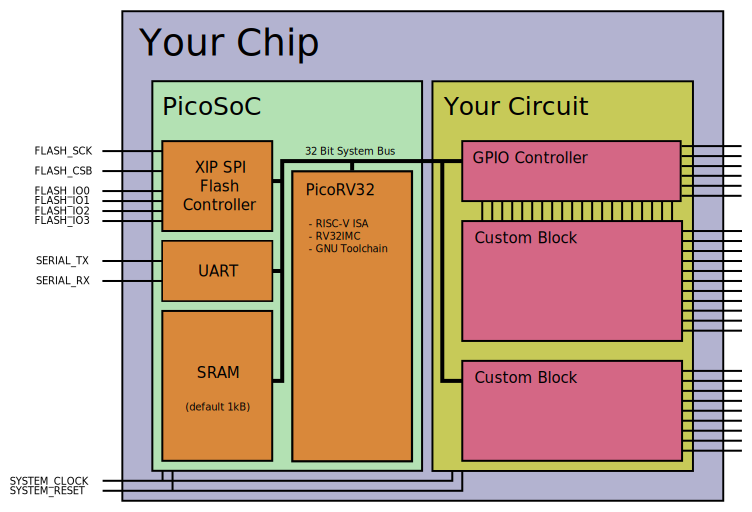

# Introducción a la práctica

El objetivo de la práctica es la síntesis en silicio de un SoC basado en un procesador RISC-V con varios periféricos sencillos.

Esta práctica se divide en dos partes, en la primera se generará la macro del SoC y en la segunda parte se añadirán los pads y el I/O necesario para tener cun componente completamente diseñado y listo para mandarse a fabricar.

El proyecto se va a realizar usando el PDK ihp-sg13g2

# Descripción del picosoc
El picosoc es un pequeño SoC basado en el procesador RISC-V picorv32 con un pequeño juego de periféricos e interfaces de memoria.



Las fuentes están disponibles dentro del proyecto del picorv32 en github:

[https://github.com/YosysHQ/picorv32.git](https://github.com/YosysHQ/picorv32.git)

Dispone de configuraciones para su síntesis en FPGAs o en ASIC. Para este último caso es posibel usarlo sin necesidad de primitivas de FPGA y la memoria se implementara como DFFRAM (RAM sintentizada usando Flip flops y latches). Esta memoria no se tratará como una macro independiente sino como lógica dentro del SOC.

# Descarga y preparación de las fuentes del proyecto picosoc
El primer paso es preparar las fuentes y modificarlas para reducir el número de I/O que se expone en el SOC. Por defecto exporta todo el bus de memoria del procesador, pero estas señales no vamos a llevarlas hacia el exterior.

Estos pasos se van a ejecutar en la máquina host, una vez todo esté preparado se iniciarán los pasos en el sistema docker que contienen las herramientas instaladas.

1. Descarga de las fuentes
Entramos en el directorio en donde otros proyectos almacenan las fuentes y descargamos el proyecto:

``` text
cd ~/Proyectos/demo_openroad/OpenROAD-flow-scripts/flow/designs/src
git clone https://github.com/YosysHQ/picorv32
cd picorv32
```

2. Modificación de las fuentes
Dentro del directorio en donde están las fuentes del picorv32 existe una carpeta llamada picosoc, dentro de ésta el fichero picosoc.v contiene el top module del SoC.

Editamos este fichero y haremos los siguientes cambios:

1. Eliminar el bus de memoria hacia fuera
```
module picosoc (
	input clk,
	input resetn,

	output        iomem_valid,
	input         iomem_ready,
	output [ 3:0] iomem_wstrb,
	output [31:0] iomem_addr,
	output [31:0] iomem_wdata,
	input  [31:0] iomem_rdata,
```

se cambia por:

```
module picosoc (
	input clk,
	input resetn,

	//output        iomem_valid,
	//input         iomem_ready,
	//output [ 3:0] iomem_wstrb,
	//output [31:0] iomem_addr,
	//output [31:0] iomem_wdata,
	//input  [31:0] iomem_rdata,
```

2. Añadimos más señales de irq:

```
	//input  [31:0] iomem_rdata,

	input  irq_5,
	input  irq_6,
	input  irq_7,

	output ser_tx,
	input  ser_rx,
```

se cambia por:

```
	//input  [31:0] iomem_rdata,

	input  irq_5,
	input  irq_6,
	input  irq_7,
	input  irq_8,
	input  irq_9,
	input  irq_10,
	input  irq_11,

	output ser_tx,
	input  ser_rx,
```

3. Modificamos la configuración del core para tener todas las opciones:

``` 
       parameter [0:0] ENABLE_DIV = 1;
       parameter [0:0] ENABLE_FAST_MUL = 0;
       parameter [0:0] ENABLE_COMPRESSED = 1;
       parameter [0:0] ENABLE_COUNTERS = 1;
       parameter [0:0] ENABLE_IRQ_QREGS = 0;
```

se cambia por:

```
       parameter [0:0] ENABLE_DIV = 1;
       parameter [0:0] ENABLE_FAST_MUL = 1;
       parameter [0:0] ENABLE_COMPRESSED = 1;
       parameter [0:0] ENABLE_COUNTERS = 1;
       parameter [0:0] ENABLE_IRQ_QREGS = 1;
```

4. Reducimos la memoria del SOC, esto ayudará a mantener los tiempos de place y route contenidos. La memoria se define en palabras de 32 bits, bajamos de 1kByte a 512byte.

```
       parameter integer MEM_WORDS = 256;
```

se cambia por:

```
       parameter integer MEM_WORDS = 128;
```

5. Conectamos las señales de irq externas con las del procesador:

```
always @* begin
		irq = 0;
		irq[3] = irq_stall;
		irq[4] = irq_uart;
		irq[5] = irq_5;
		irq[6] = irq_6;
		irq[7] = irq_7;
```

se cambia por:

```
always @* begin
		irq = 0;
		irq[3] = irq_stall;
		irq[4] = irq_uart;
		irq[5] = irq_5;
		irq[6] = irq_6;
		irq[7] = irq_7;
		irq[8] = irq_8;
		irq[9] = irq_9;
		irq[10] = irq_10;
		irq[11] = irq_11;
``` 

Una vez hechos los cambios podemos ejecutar el comando `git diff` para ver que se han aplicado todos ellos.

# Generación de macro inicial

## Objetivo
El objetivo es realizar una primera síntesis completa de RTL a GDSII del diseño pero sin que se añadan los I/O o los pads para hacer bonding. Al final de esta parte tendremos un proyecto que sintentiza y cumple los tiempos requeridos.

## Creación de configuración del proyecto
Seguimos trabajando en la máquina host. Volvemos al directorio de partida y entramos dentro del directorio en donde se alojan los proyectos basados en el proceso ihp-sg13g2.

```
cd ~/Proyectos/demo_openroad/OpenROAD-flow-scripts/flow/
cd designs
cd ihp-sg13g2
```

Crearemos un directorio en donde alojaremos nuestro proyecto:

```
mkdir picosoc
cd picosoc
```

Una vez dentro del directorio generamos dos ficheros vacíos que serán el punto de partida del proyecto:

```
touch config.mk
touch constraint.sdc
```

## Configuración del entorno de trabajo
En los siguientes pasos se va a ir alternando entre la máquina host y la máquina docker. Recomendamos tener dos terminales, uno a cada lado para poder trabajar en cada uno de estos entornos:


Dentro de la consola en la que se ejecuta docker entramos con los siguientes comandos:

```
cd ~/Proyectos/demo_openroad/OpenROAD-flow-scripts/
sh docker_gui.sh
source env.sh 
cd flow
```

Recordemos el contenido del script docker_gui.sh:

```
docker run --rm -it \
           -u $(id -u ${USER}):$(id -g ${USER}) \
           -v $(pwd)/flow:/OpenROAD-flow-scripts/flow \
           -v /etc/passwd:/etc/passwd:ro \
           -v /etc/group:/etc/group:ro \
           -e DISPLAY=${DISPLAY} \
           -v /tmp/.X11-unix:/tmp/.X11-unix \
           -v ${HOME}/.Xauthority:/.Xauthority \
           --network host \
           --security-opt seccomp=unconfined \
           openroad/flow-ubuntu22.04-builder:8287a5
```

El valor `8287a5`es el identificador de la imagen de docker que se obtiene al ejecutar el comando `docker images`. Pueden exitir múltiples instalaciones de las herramientas en el sistema sin interferir entre ellas.

Recomendamos editar el fichero y copiar el contenido en vez de usar el comando `echo`, dado que este comando va a resolver las variables del sistema cuando se escriba el fichero y éstas pueden verse modificadas.

## Configuración de la síntesis
### Preparación de los ficheros
Vamos al directorio en donde está la configuración del proyecto

```
cd ~/Proyectos/demo_openroad/OpenROAD-flow-scripts/flow/designs/ihp-sg13g2/picosoc
```

Primero editamos el fichero `config.mk`. Añadimos el siguiente contenido al principio:

```
export PLATFORM               = ihp-sg13g2

export DESIGN_NAME            = picosoc

# synth
export SYNTH_MEMORY_MAX_BITS  = 128000

export VERILOG_FILES          = $(DESIGN_HOME)/src/picorv32/picosoc/picosoc.v \
                                $(DESIGN_HOME)/src/picorv32/picosoc/simpleuart.v \
                                $(DESIGN_HOME)/src/picorv32/picosoc/spimemio.v \
                                $(DESIGN_HOME)/src/picorv32/picorv32.v
export SDC_FILE               = $(DESIGN_HOME)/$(PLATFORM)/$(DESIGN_NAME)/constraint.sdc
```

La variable `PLATFORM` debe tener el nombre del proceso tecnológico que se va a usar y ayudará a la herramienta a encontrar ficheros importantes:

[https://openroad-flow-scripts.readthedocs.io/en/latest/user/FlowVariables.html#platform](https://openroad-flow-scripts.readthedocs.io/en/latest/user/FlowVariables.html#platform)

La variable `DESIGN_NAME` debe ser igual que el directorio en donde se aloja el fichero de configuración, es recomendable que coincida también con el nombre del objeto del Top Module del diseño.

[https://openroad-flow-scripts.readthedocs.io/en/latest/user/FlowVariables.html#design-specific-configuration-variables](https://openroad-flow-scripts.readthedocs.io/en/latest/user/FlowVariables.html#design-specific-configuration-variables)

Los valores de configuración para la síntesis se pueden consultar aquí:

[https://openroad-flow-scripts.readthedocs.io/en/latest/user/FlowVariables.html#synth-variables](https://openroad-flow-scripts.readthedocs.io/en/latest/user/FlowVariables.html#synth-variables)

La variable `SYNTH_MEMORY_MAX_BITS` se debe ajustar porque el diseño presenta memoria en forma de flip flops y Yosys (la herramienta de síntesis) requiere de esta variable cuando debe optimizar igual o más de 4096 bits (512 bytes).

Posteriormente editamos el fichero `constraint.sdc`, incluyendo el siguiente contenido:

```
current_design picosoc

set clk_name  core_clock
set clk_port_name clk
set clk_period 10
set clk_io_pct 0.2

set clk_port [get_ports $clk_port_name]

create_clock -name $clk_name -period $clk_period  $clk_port

set non_clock_inputs [lsearch -inline -all -not -exact [all_inputs] $clk_port]

set_input_delay  [expr $clk_period * $clk_io_pct] -clock $clk_name $non_clock_inputs
set_output_delay [expr $clk_period * $clk_io_pct] -clock $clk_name [all_outputs]
```

Del fichero anterior el nombre `clk` es el que coincide con la señal de clock el el top del diseño. Se fija un periodo objetivo de 10ns (100MHz) con 2ns (10*0.2) de incertidumbre en este reloj a la entrada  salida.

La definición de los constraints es similar a la existente para FPGAs.

### Ejecución de la síntesis
Entramos en la consola en la que está el sistema docker, es importante que el comando `source env.sh` sea el primero en ejecutarse nada más entrar en el sistema docker.

Si no hemos lanzado la máquina docker estos serían los pasos:

```
cd ~/Proyectos/demo_openroad/OpenROAD-flow-scripts/
sh docker_gui.sh
source env.sh 
cd flow
```

Ahora configuramos el diseño que se va a sintetizar:

```
export DESIGN_CONFIG=./designs/ihp-sg13g2/picosoc/config.mk
make clean_synth
make synth
```

Una vez finalizado veremos que ha generado el fichero `results/ihp-sg13g2/picosoc/base/1_1_yosys.v ./results/ihp-sg13g2/picosoc/base/1_synth.v`, este fichero es el Netlist que ya no contiene un verilog que describe el diseño sino el diseño completo a nivel lógico.

```
exec cp /OpenROAD-flow-scripts/flow/designs/ihp-sg13g2/picosoc/constraint.sdc ./results/ihp-sg13g2/picosoc/base/1_synth.sdc
Warnings: 2 unique messages, 2 total
End of script. Logfile hash: 7b0a3f3e67, CPU: user 8.65s system 0.12s, MEM: 222.58 MB peak
Yosys 0.51 (git sha1 UNKNOWN, g++ 11.4.0-1ubuntu1~22.04 -fPIC -O3)
Time spent: 80% 2x abc (33 sec), 5% 43x opt_clean (2 sec), ...
Elapsed time: 0:41.42[h:]min:sec. CPU time: user 41.13 sys 0.27 (99%). Peak memory: 227920KB.
mkdir -p ./results/ihp-sg13g2/picosoc/base ./logs/ihp-sg13g2/picosoc/base ./reports/ihp-sg13g2/picosoc/base
cp ./results/ihp-sg13g2/picosoc/base/1_1_yosys.v ./results/ihp-sg13g2/picosoc/base/1_synth.v
```

## Configuración del floorplan
### Preparación de los ficheros
Vamos a la consola del host y editamos el fichero `config.mk`. Añadiremos dos variables para hacer una estimación del floorplan:

```
# floorplan
export CORE_UTILIZATION = 40
export PLACE_DENSITY    = 0.50
```

Este enlace tiene la configuración de las variables del `floorplan`:

[https://openroad-flow-scripts.readthedocs.io/en/latest/user/FlowVariables.html#floorplan-variables](https://openroad-flow-scripts.readthedocs.io/en/latest/user/FlowVariables.html#floorplan-variables)

En esta configuración se ha decidido que las celdas lógicas se estime que ocupen un 40% de la superficie y que la densidad de ocupación esa de 0.5 (1.0 = celdas muy proximas; 0.0 = celdas muy separadas). Estos son valores iniciales de trabajo.

### Ejecución del floorplan
Entramos en la consola en la que está el sistema docker y ejecutamos el floorplan:

```
make floorplan
```

Una vez terminado veremos los resultados:

```
==========================================================================
floorplan final report_design_area
--------------------------------------------------------------------------
Design area 1009977 u^2 40% utilization.
Elapsed time: 0:12.94[h:]min:sec. CPU time: user 18.87 sys 19.87 (299%). Peak memory: 371944KB.
/OpenROAD-flow-scripts/flow/scripts/flow.sh 2_2_floorplan_macro macro_place
Running macro_place.tcl, stage 2_2_floorplan_macro
source /OpenROAD-flow-scripts/flow/platforms/ihp-sg13g2/setRC.tcl
No macros found: Skipping macro_placement
Elapsed time: 0:00.33[h:]min:sec. CPU time: user 0.26 sys 0.06 (99%). Peak memory: 191260KB.
/OpenROAD-flow-scripts/flow/scripts/flow.sh 2_3_floorplan_tapcell tapcell
Running tapcell.tcl, stage 2_3_floorplan_tapcell
source /OpenROAD-flow-scripts/flow/platforms/ihp-sg13g2/setRC.tcl
Elapsed time: 0:00.26[h:]min:sec. CPU time: user 0.22 sys 0.04 (100%). Peak memory: 147744KB.
/OpenROAD-flow-scripts/flow/scripts/flow.sh 2_4_floorplan_pdn pdn
Running pdn.tcl, stage 2_4_floorplan_pdn
source /OpenROAD-flow-scripts/flow/platforms/ihp-sg13g2/setRC.tcl
[INFO PDN-0001] Inserting grid: grid
Elapsed time: 0:00.57[h:]min:sec. CPU time: user 0.51 sys 0.06 (100%). Peak memory: 199144KB.
cp ./results/ihp-sg13g2/picosoc/base/2_4_floorplan_pdn.odb ./results/ihp-sg13g2/picosoc/base/2_floorplan.odb
cp ./results/ihp-sg13g2/picosoc/base/2_1_floorplan.sdc ./results/ihp-sg13g2/picosoc/base/2_floorplan.sdc
```

Lanzamos la interfaz gráfica para verificar las dimensiones del componente:

```
make gui_floorplan
```

Podemos escoger la herramienta de medida para ver el tamaño `Tools->Ruler`:


Aquí vemos que el tamaño es de aproximadamente 1622um, ambas dimensiones son iguales por defecto.

## Configuración del place
### Preparación de los ficheros
Las variables de configuración para el proceso de `place` están en:

[https://openroad-flow-scripts.readthedocs.io/en/latest/user/FlowVariables.html#place-variables](https://openroad-flow-scripts.readthedocs.io/en/latest/user/FlowVariables.html#place-variables)

La variable `PLACE_DENSITY` del fichero `config.mk`, que ya se ajustó en el apartado de `floorplan`, también es usada en este proceso.

en este diseño no necesitamos añadir ninguna variable más.

### Ejecución del place
Entramos en la consola en la que está el sistema docker y ejecutamos el place:

```
make place
```

Una vez terminado veremos los resultados de esta colocación:

```
==========================================================================
detailed place report_design_area
--------------------------------------------------------------------------
Design area 1006451 u^2 40% utilization.
Elapsed time: 0:24.64[h:]min:sec. CPU time: user 32.82 sys 27.58 (245%). Peak memory: 670004KB.
cp ./results/ihp-sg13g2/picosoc/base/3_5_place_dp.odb ./results/ihp-sg13g2/picosoc/base/3_place.odb
cp ./results/ihp-sg13g2/picosoc/base/2_floorplan.sdc ./results/ihp-sg13g2/picosoc/base/3_place.sdc
```

Este proceso ha conseguido mantener la utilización en el 40%, que es lo solicitado en la variable de configuración. Podría darse el caso que en este proceso se aumente ligeramente el espacio utilizado al colocar finalmente las celdas lógicas.

## Configuración del CTS
### Preparación de los ficheros
Las variables de configuración para el proceso de `CTS` están en:

[https://openroad-flow-scripts.readthedocs.io/en/latest/user/FlowVariables.html#cts-variables](https://openroad-flow-scripts.readthedocs.io/en/latest/user/FlowVariables.html#cts-variables)

En el fichero `config.mk` vamos a añadir una variable:

```
# cts
export TNS_END_PERCENT = 100
```

Ese valor indica que debe resolver el 100% de los problemas de reloj que se encuentre, aunque no estén en el camino crítico.

### Ejecución del CTS
Entramos en la consola en la que está el sistema docker y ejecutamos el CTS:

```
make cts
```

Una vez terminado veremos los resultados del reloj:

```
==========================================================================
cts final report_design_area
--------------------------------------------------------------------------
Design area 1192063 u^2 47% utilization.
Elapsed time: 0:23.24[h:]min:sec. CPU time: user 39.43 sys 43.95 (358%). Peak memory: 991164KB.
cp ./results/ihp-sg13g2/picosoc/base/4_1_cts.odb ./results/ihp-sg13g2/picosoc/base/4_cts.odb
```

Se observa que ha aumentado el espacio usitlizado de un 40% a un 47% debido a las celdas lógicas y buffers que se han insertado para distribuir el árbol de relojes del diseño.

## Configuración del route
### Preparación de los ficheros
Este proceso se realiza en dos fase, una de rutado inicial y luego el rutado detallado, por ello tiene dos apartados con documentación de las variables involucradas:

[https://openroad-flow-scripts.readthedocs.io/en/latest/user/FlowVariables.html#grt-variables](https://openroad-flow-scripts.readthedocs.io/en/latest/user/FlowVariables.html#grt-variables)
[https://openroad-flow-scripts.readthedocs.io/en/latest/user/FlowVariables.html#route-variables](https://openroad-flow-scripts.readthedocs.io/en/latest/user/FlowVariables.html#route-variables)

La variable `TNS_END_PERCENT` del fichero `config.mk`, que ya se ajustó en el apartado de `CTS`, también es usada en este proceso.

No se hace ninguna configuración adicional.

### Ejecución de la síntesis
Entramos en la consola en la que está el sistema docker y ejecutamos el route:

```
make route
```

Una vez terminado veremos los resultados del rutado:

```
[INFO DRT-0180] Post processing.
Took 298 seconds: detailed_route -output_drc ./reports/ihp-sg13g2/picosoc/base/5_route_drc.rpt -output_maze ./results/ihp-sg13g2/picosoc/base/maze.log -bottom_routing_layer Metal2 -top_routing_layer Metal5 -droute_end_iter 64 -verbose 1 -drc_report_iter_step 5
[INFO ANT-0002] Found 141 net violations.
[INFO ANT-0001] Found 149 pin violations.
Elapsed time: 5:01.01[h:]min:sec. CPU time: user 5988.05 sys 21.11 (1996%). Peak memory: 7283676KB.
/OpenROAD-flow-scripts/flow/scripts/flow.sh 5_3_fillcell fillcell
Running fillcell.tcl, stage 5_3_fillcell
source /OpenROAD-flow-scripts/flow/platforms/ihp-sg13g2/setRC.tcl
filler_placement "sg13g2_fill_1 sg13g2_fill_2 sg13g2_decap_4 sg13g2_decap_8"
[INFO DPL-0001] Placed 148164 filler instances.
Elapsed time: 0:01.50[h:]min:sec. CPU time: user 1.30 sys 0.19 (99%). Peak memory: 599796KB.
cp ./results/ihp-sg13g2/picosoc/base/5_3_fillcell.odb ./results/ihp-sg13g2/picosoc/base/5_route.odb
cp ./results/ihp-sg13g2/picosoc/base/5_1_grt.sdc ./results/ihp-sg13g2/picosoc/base/5_route.sdc
```

## Finalización
### Preparación de los ficheros
Las variables de configuración para el proceso de `final` están en:

[https://openroad-flow-scripts.readthedocs.io/en/latest/user/FlowVariables.html#final-variables](https://openroad-flow-scripts.readthedocs.io/en/latest/user/FlowVariables.html#final-variables)

En el fichero `config.mk` ajustamos la variable que indica la tensión a la que se calcula la caída de tensión y el consumo del componente. En este tecnología por defecto son 1.2V y lo ponemos en 1.8V.

```
# final
export PWR_NETS_VOLTAGES = VDD 1.8
```

### Ejecución del diseño final
Entramos en la consola en la que está el sistema docker y ejecutamos el final:

```
make final
```

Una vez terminado veremos los resultados finales:

```
Elapsed time: 0:03.78[h:]min:sec. CPU time: user 3.52 sys 0.26 (99%). Peak memory: 1043596KB.
cp results/ihp-sg13g2/picosoc/base/6_1_merged.gds results/ihp-sg13g2/picosoc/base/6_final.gds
./logs/ihp-sg13g2/picosoc/base
Log                            Elapsed seconds Peak Memory/MB
1_1_yosys                                   41            222
1_1_yosys_canonicalize                       0             37
2_1_floorplan                               12            363
2_2_floorplan_macro                          0            186
2_3_floorplan_tapcell                        0            144
2_4_floorplan_pdn                            0            194
3_1_place_gp_skip_io                        22            291
3_2_place_iop                                0            187
3_3_place_gp                                70            870
3_4_place_resized                           17            555
3_5_place_dp                                24            654
4_1_cts                                     23            967
5_1_grt                                     46           1716
5_2_route                                  301           7112
5_3_fillcell                                 1            585
6_1_fill                                     0            293
6_1_merge                                    3           1019
6_report                                    98           2175
Total                                      658           7112
```

Una vez terminado lanzamos la visualización para ver el resultado:

```
make gui_final
```


# Generación de un SOC completo

## Objetivo
Los pasos anteriores han generado una macro y sobre todo han permitido obtener unos parámetros iniciales de espacio utilizado por el diseño. No se han hecho una optimización de espacio.

El siguiente punto consiste en la modificación del diseño para poder incorporar los PADs de conexión al exterior, los PADs de bonding y ajustar la alimentación.

## Descripción del I/O del ihp-sg13g2
El proceso ihp-sg13g2 posee una librería de componentes aptos para realizar procesos de I/O. Estos componentes tienen la siguiente características:
- Pueden funcionar con una tensión distinta de la del Core. Cuando hay I/O tendremos VDD para el core y VDDIO para la entrada salida, ambos valores no tienen porque coincidir. En este proceso el Core está probado a 1.2V y el I/O hasta 3.3V.
- Poseen protecciones contra electricidad estática usando diodos de clamping contra alimentación y masa
- Tienen transistores más grandes que las celdas lógicas para poder entregar o consumir más corriente.

Dentro de la consola del host podemos consultar los siguientes ficheros:

```
cd ~/Proyectos/demo_openroad/OpenROAD-flow-scripts/flow/platforms/ihp-sg13g2
```

Ahí dentro podemos ver el fichero `verilog/sg13g2_io.v` en donde podemos ver las definiciones en verilog de los bloques de I/O y las señales de control que tienen 

Por ejemplo la siguiente celda de I/O:

```
// type: TriStateOutput4mA
`timescale 1ns/10ps
`celldefine
module sg13g2_IOPadTriOut4mA (pad, c2p, c2p_en);
        inout pad;
        input c2p;
        input c2p_en;

        // Function
        assign pad = (c2p_en) ? c2p : 1'bz;

        // Timing
        specify
                if (c2p_en == 1'b1)
                        (c2p => pad) = 0;
        endspecify
endmodule
```

El nombre indica que es un Pad de salida triestado con hasta 4mA de corriente de salida. Tiene tres señales de control:
- pad: se corresponde con el pad que hace de interfaz con el exterior
- c2p: señal a la entrada que puede o no conectarse con la salida
- c2p_en: señal de habilitación de la salida, escoge entre conectar c2p a pad o dejar la salida en alta impedancia

Al final del fichero también se definen otras celdas como son las de alimentación para que estén accesibles en el flujo de trabajo aunque no se conectan a ninguna señal. Esta definición es propia de cada PDK.

```
// type: IOVss
`timescale 1ns/10ps
`celldefine
module sg13g2_IOPadIOVss ();
endmodule
`endcelldefine

// type: IOVdd
`timescale 1ns/10ps
`celldefine
module sg13g2_IOPadIOVdd ();
endmodule
`endcelldefine

// type: Vss
`timescale 1ns/10ps
`celldefine
module sg13g2_IOPadVss ();
endmodule
`endcelldefine

// type: Vdd
`timescale 1ns/10ps
`celldefine
module sg13g2_IOPadVdd ();
endmodule
`endcelldefine
```

En el fichero `lib/sg13g2_io_typ_1p2V_3p3V_25C.lib` podemos ver las características de estos bloques a nivel eléctrico. Estos es importante para ajustar en el fichero de constraints los retardos de las señales (configuración en bloque de `timing` en ese fichero).

```
pin (pad) {
      direction : "inout";
      is_pad : true;
      function : "c2p";
      three_state : "c2p_en'";
      drive_current : 4;
      output_voltage : "pad";
      input_voltage : "pad";
      related_ground_pin : iovss;
      related_power_pin : iovdd;
      max_capacitance : 1.07593;
      capacitance : 0.188577;
      rise_capacitance : 0.189895;
      rise_capacitance_range (0.162282, 0.208866);
      fall_capacitance : 0.187258;
      fall_capacitance_range (0.166164, 0.200869);
      timing () {
        related_pin : "c2p";
        timing_sense : positive_unate;
        timing_type : combinational;
        cell_rise (delay_template_7x6_16) {
          index_1 ("0.02, 0.1, 0.17, 0.33, 0.64, 1.26, 2.5");
          index_2 ("1, 2, 3, 4, 7, 10");
          values ( \
            "1.54948, 1.98537, 2.41868, 2.85128, 4.1479, 5.44429", \
            "1.56845, 2.00432, 2.43764, 2.87024, 4.16695, 5.4629", \
            "1.58291, 2.01883, 2.45217, 2.88478, 4.18153, 5.47811", \
            "1.60745, 2.04325, 2.47656, 2.90912, 4.20581, 5.50245", \
            "1.63562, 2.07151, 2.50485, 2.9375, 4.23404, 5.53004", \
            "1.6732, 2.10917, 2.54258, 2.9752, 4.27173, 5.56774", \
            "1.71191, 2.14777, 2.58125, 3.01361, 4.31037, 5.60624" \
          );
        }
```

En el fichero `lef/sg13g2_io.lef` podemos ver las definiciones de la geometría de las celdas. Por ejemplo para el caso del sg13g2_IOPadTriOut4mA podemos ver las capas en las que están las señales:

```
MACRO sg13g2_IOPadTriOut4mA
    CLASS PAD OUTPUT ;
    ORIGIN 0.000 0.000 ;
    FOREIGN sg13g2_IOPadTriOut4mA 0.000 0.000 ;
    SIZE 80.000 BY 180.000 ;
    SYMMETRY X Y R90 ;
    SITE sg13g2_ioSite ;
  PIN c2p
    DIRECTION INPUT ;
    USE SIGNAL ;
    PORT
      LAYER Metal2 ;
        RECT 38.330 178.090 38.620 180.000 ;
      LAYER Metal3 ;
        RECT 38.225 179.710 38.725 180.000 ;
    END
  END c2p
  PIN c2p_en 
    DIRECTION INPUT ;
    USE SIGNAL ;
    PORT
      LAYER Metal2 ;
        RECT 41.380 174.045 41.670 180.000 ;
      LAYER Metal3 ;
        RECT 41.275 179.710 41.775 180.000 ;
    END 
  END c2p_en
  ```

  La definición continúa con los pines de alimentación de core y de I/O. Podemos ver que usan todas las capas de metalización hasta la TopMetal2 que es la superior en donde se colocan los pads de conexión al exterior. En este diagrama es la metalización superior con un grosor de 300um.

  

Deberemos ajustar el diseño para que ahora las señales de salida vayan a PADs de este proceso.

## Creación de la estructura de ficheros

Vamos a crear el proyecto desde la consola del host, similar a lo ya generado con el diseño anterior:

```
cd ~/Proyectos/demo_openroad/flow/
cd designs
cd ihp-sg13g2
mkdir picosoc_ihp
cd picosoc_ihp
```

Una vez dentro del directorio generamos dos ficheros vacíos que serán el punto de partida del proyecto:

```
touch config.mk
touch constraint.sdc
touch pad.tcl
touch pdn.tcl
touch picosoc_ihp.v
```

El wrapper de verilog del SoC se genera en la carpeta del proyecto para tenerlo asociado al proyecto de este PDK.

## Creación del wrapper de verilog del SoC
Dentro de la carpeta del proyecto vamos a editar el fichero `picosoc_ihp.v`. Este fichero contiene un wrapper que permite unir las señales del SOC diseñado en los appartados anteriores con los PADs del procesador.

En este primera versión solo se usan PADs de entrada (sg13g2_IOPadIn) y PADs de salida con una corriente máxima de salida de 4mA (sg13g2_IOPadOut4mA).

En este fichero las distintas señales se van conectando a los PADs y además es posible incluir lógica, en este ejemplo algunas señales están siendo registradas (dentro del bloque always) mientras que otras se conectan de manera asíncrona.

Este es el código resultante:

```
`timescale 1ns/1ps

// definimos las señales que estarán conectadas a los I/O
module picosoc_ihp (
  inout  wire        io_clk_PAD,
  inout  wire        io_resetn_PAD,
  inout  wire        io_irq_5_PAD,
  inout  wire        io_irq_6_PAD,
  inout  wire        io_irq_7_PAD,
  inout  wire        io_irq_8_PAD,
  inout  wire        io_irq_9_PAD,
  inout  wire        io_irq_10_PAD,
  inout  wire        io_irq_11_PAD,
  inout  wire        io_ser_tx_PAD,
  inout  wire        io_ser_rx_PAD, 
  inout  wire        io_flash_csb_PAD,
  inout  wire        io_flash_clk_PAD,
  inout  wire        io_flash_io0_oe_PAD,
  inout  wire        io_flash_io1_oe_PAD,
  inout  wire        io_flash_io2_oe_PAD,
  inout  wire        io_flash_io3_oe_PAD,
  inout  wire        io_flash_io0_do_PAD,
  inout  wire        io_flash_io1_do_PAD,
  inout  wire        io_flash_io2_do_PAD,
  inout  wire        io_flash_io3_do_PAD,
  inout  wire        io_flash_io0_di_PAD,
  inout  wire        io_flash_io1_di_PAD,
  inout  wire        io_flash_io2_di_PAD,
  inout  wire        io_flash_io3_di_PAD
);

 wire sg13g2_IOPad_io_clock_p2c;
 wire sg13g2_IOPad_io_reset_p2c;
 wire clock;
 wire reset;

 wire sg13g2_IOPad_io_irq_5_p2c;
 wire sg13g2_IOPad_io_irq_6_p2c;
 wire sg13g2_IOPad_io_irq_7_p2c;
 wire sg13g2_IOPad_io_irq_8_p2c;
 wire sg13g2_IOPad_io_irq_9_p2c;
 wire sg13g2_IOPad_io_irq_10_p2c;
 wire sg13g2_IOPad_io_irq_11_p2c;
 reg  irq_5_p2c;
 reg  irq_6_p2c;
 reg  irq_7_p2c;
 reg  irq_8_p2c;
 reg  irq_9_p2c;
 reg  irq_10_p2c;
 reg  irq_11_p2c;

 wire sg13g2_IOPad_io_ser_tx_c2p;
 wire sg13g2_IOPad_io_ser_rx_p2c;

 wire sg13g2_IOPad_io_flash_csb_c2p;
 wire sg13g2_IOPad_io_flash_clk_c2p;

 wire sg13g2_IOPad_io_flash_io0_oe_c2p;
 wire sg13g2_IOPad_io_flash_io1_oe_c2p;
 wire sg13g2_IOPad_io_flash_io2_oe_c2p;
 wire sg13g2_IOPad_io_flash_io3_oe_c2p;
 wire sg13g2_IOPad_io_flash_io0_do_c2p;
 wire sg13g2_IOPad_io_flash_io1_do_c2p;
 wire sg13g2_IOPad_io_flash_io2_do_c2p;
 wire sg13g2_IOPad_io_flash_io3_do_c2p;
 wire sg13g2_IOPad_io_flash_io0_di_p2c;
 wire sg13g2_IOPad_io_flash_io1_di_p2c;
 wire sg13g2_IOPad_io_flash_io2_di_p2c;
 wire sg13g2_IOPad_io_flash_io3_di_p2c;

 // Clock
 sg13g2_IOPadIn sg13g2_IOPad_io_clock (.p2c (sg13g2_IOPad_io_clock_p2c), .pad (io_clk_PAD));
 // Reset
 sg13g2_IOPadIn sg13g2_IOPad_io_reset (.p2c (sg13g2_IOPad_io_reset_p2c), .pad (io_resetn_PAD));
 // IRQ
 sg13g2_IOPadIn sg13g2_IOPad_io_irq_5  (.p2c (sg13g2_IOPad_io_irq_5_p2c),  .pad (io_irq_5_PAD));
 sg13g2_IOPadIn sg13g2_IOPad_io_irq_6  (.p2c (sg13g2_IOPad_io_irq_6_p2c),  .pad (io_irq_6_PAD));
 sg13g2_IOPadIn sg13g2_IOPad_io_irq_7  (.p2c (sg13g2_IOPad_io_irq_7_p2c),  .pad (io_irq_7_PAD));
 sg13g2_IOPadIn sg13g2_IOPad_io_irq_8  (.p2c (sg13g2_IOPad_io_irq_8_p2c),  .pad (io_irq_8_PAD));
 sg13g2_IOPadIn sg13g2_IOPad_io_irq_9  (.p2c (sg13g2_IOPad_io_irq_9_p2c),  .pad (io_irq_9_PAD));
 sg13g2_IOPadIn sg13g2_IOPad_io_irq_10 (.p2c (sg13g2_IOPad_io_irq_10_p2c), .pad (io_irq_10_PAD));
 sg13g2_IOPadIn sg13g2_IOPad_io_irq_11 (.p2c (sg13g2_IOPad_io_irq_11_p2c), .pad (io_irq_11_PAD));
 // UART
 sg13g2_IOPadOut4mA sg13g2_IOPad_io_ser_tx (.c2p (sg13g2_IOPad_io_ser_tx_c2p), .pad (io_ser_tx_PAD));
 sg13g2_IOPadIn     sg13g2_IOPad_io_ser_rx (.p2c (sg13g2_IOPad_io_ser_rx_p2c), .pad (io_ser_rx_PAD));

 // Flash controllers
 sg13g2_IOPadOut4mA sg13g2_IOPad_io_flash_csb (.c2p (sg13g2_IOPad_io_flash_csb_c2p), .pad (io_flash_csb_PAD));
 sg13g2_IOPadOut4mA sg13g2_IOPad_io_flash_clk (.c2p (sg13g2_IOPad_io_flash_clk_c2p), .pad (io_flash_clk_PAD));

 sg13g2_IOPadOut4mA sg13g2_IOPad_io_flash_io0_oe (.c2p (sg13g2_IOPad_io_flash_io0_oe_c2p), .pad (io_flash_io0_oe_PAD));
 sg13g2_IOPadOut4mA sg13g2_IOPad_io_flash_io1_oe (.c2p (sg13g2_IOPad_io_flash_io1_oe_c2p), .pad (io_flash_io1_oe_PAD));
 sg13g2_IOPadOut4mA sg13g2_IOPad_io_flash_io2_oe (.c2p (sg13g2_IOPad_io_flash_io2_oe_c2p), .pad (io_flash_io2_oe_PAD));
 sg13g2_IOPadOut4mA sg13g2_IOPad_io_flash_io3_oe (.c2p (sg13g2_IOPad_io_flash_io3_oe_c2p), .pad (io_flash_io3_oe_PAD));

 sg13g2_IOPadOut4mA sg13g2_IOPad_io_flash_io0_do (.c2p (sg13g2_IOPad_io_flash_io0_do_c2p), .pad (io_flash_io0_do_PAD));
 sg13g2_IOPadOut4mA sg13g2_IOPad_io_flash_io1_do (.c2p (sg13g2_IOPad_io_flash_io1_do_c2p), .pad (io_flash_io1_do_PAD));
 sg13g2_IOPadOut4mA sg13g2_IOPad_io_flash_io2_do (.c2p (sg13g2_IOPad_io_flash_io2_do_c2p), .pad (io_flash_io2_do_PAD));
 sg13g2_IOPadOut4mA sg13g2_IOPad_io_flash_io3_do (.c2p (sg13g2_IOPad_io_flash_io3_do_c2p), .pad (io_flash_io3_do_PAD));

 sg13g2_IOPadIn sg13g2_IOPad_io_flash_io0_di (.p2c (sg13g2_IOPad_io_flash_io0_di_p2c), .pad (io_flash_io0_di_PAD));
 sg13g2_IOPadIn sg13g2_IOPad_io_flash_io1_di (.p2c (sg13g2_IOPad_io_flash_io1_di_p2c), .pad (io_flash_io1_di_PAD));
 sg13g2_IOPadIn sg13g2_IOPad_io_flash_io2_di (.p2c (sg13g2_IOPad_io_flash_io2_di_p2c), .pad (io_flash_io2_di_PAD));
 sg13g2_IOPadIn sg13g2_IOPad_io_flash_io3_di (.p2c (sg13g2_IOPad_io_flash_io3_di_p2c), .pad (io_flash_io3_di_PAD));

 // async signals
 assign clock = sg13g2_IOPad_io_clock_p2c;
 assign reset = sg13g2_IOPad_io_reset_p2c;

 // sync signals
 always @(*) begin
    irq_5_p2c  = sg13g2_IOPad_io_irq_5_p2c;
    irq_6_p2c  = sg13g2_IOPad_io_irq_6_p2c;
    irq_7_p2c  = sg13g2_IOPad_io_irq_7_p2c;
    irq_8_p2c  = sg13g2_IOPad_io_irq_8_p2c;
    irq_9_p2c  = sg13g2_IOPad_io_irq_9_p2c;
    irq_10_p2c = sg13g2_IOPad_io_irq_10_p2c;
    irq_11_p2c = sg13g2_IOPad_io_irq_11_p2c;
 end

 picosoc picosoc_core (
	.clk(clock),
	.resetn(reset),
    .irq_5(irq_5_p2c),
    .irq_6(irq_6_p2c),
    .irq_7(irq_7_p2c),
    .irq_8(irq_8_p2c),
    .irq_9(irq_9_p2c),
    .irq_10(irq_10_p2c),
    .irq_11(irq_11_p2c),
    // suponemos que estas señales son registradas en el periférico
    .ser_tx(sg13g2_IOPad_io_ser_tx_c2p),
    .ser_rx(sg13g2_IOPad_io_ser_rx_p2c),
    .flash_csb(sg13g2_IOPad_io_flash_csb_c2p),
    .flash_clk(sg13g2_IOPad_io_flash_clk_c2p),
	.flash_io0_oe(sg13g2_IOPad_io_flash_io0_oe_c2p),
	.flash_io1_oe(sg13g2_IOPad_io_flash_io1_oe_c2p),
	.flash_io2_oe(sg13g2_IOPad_io_flash_io2_oe_c2p),
	.flash_io3_oe(sg13g2_IOPad_io_flash_io3_oe_c2p),
    .flash_io0_do(sg13g2_IOPad_io_flash_io0_do_c2p),
	.flash_io1_do(sg13g2_IOPad_io_flash_io1_do_c2p),
	.flash_io2_do(sg13g2_IOPad_io_flash_io2_do_c2p),
	.flash_io3_do(sg13g2_IOPad_io_flash_io3_do_c2p),
	.flash_io0_di(sg13g2_IOPad_io_flash_io0_di_p2c),
	.flash_io1_di(sg13g2_IOPad_io_flash_io1_di_p2c),
	.flash_io2_di(sg13g2_IOPad_io_flash_io2_di_p2c),
	.flash_io3_di(sg13g2_IOPad_io_flash_io3_di_p2c)
 );

endmodule
```

Los pines de I/O poseen un modelo en Verilog que permite su simulación, con lo que es posibel hacer una simulación completa del diseño con los PADs conectados.

## Creación del fichero de constraints
Dentro de la carpeta del proyecto editamos el fichero `constraint.sdc`. En este fichero se incluyen configuraciones de los relojes y se añaden los retardos estimados de los PADs de I/O. Estos retardos se pueden estimar de la respuesta eléctrica del sistema. Además sirven como estimador del límite de frecuencia de trabajo de las señales del I/O.

Las señales conectadas a los PADs de salida en las macros (y en el top del verilog) serán las usadas.

El contenido del archivo es el siguiente:

```
current_design SG13G2Top
set_units -time ns -resistance kOhm -capacitance pF -voltage V -current uA
set_max_fanout 8 [current_design]
set_max_capacitance 0.5 [current_design]
set_max_transition 3 [current_design]
set_max_area 0

set_ideal_network [get_pins sg13g2_IOPad_io_clock/p2c]
create_clock [get_pins sg13g2_IOPad_io_clock/p2c] -name clk_core -period 50.0 -waveform {0 25.0}
set_clock_uncertainty 0.15 [get_clocks clk_core]
set_clock_transition 0.25 [get_clocks clk_core]

set clock_ports [get_ports { 
	io_clk_PAD 
}]
set_driving_cell -lib_cell sg13g2_IOPadIn -pin pad $clock_ports

set clk_core_input_ports [get_ports { 
	io_resetn_PAD 
	io_irq_5_PAD 
	io_irq_6_PAD
	io_irq_7_PAD
	io_irq_8_PAD
	io_irq_9_PAD
	io_irq_10_PAD
	io_irq_11_PAD	 
	io_ser_rx_PAD
	io_flash_io0_di_PAD
	io_flash_io1_di_PAD
	io_flash_io2_di_PAD
	io_flash_io3_di_PAD
}] 
set_driving_cell -lib_cell sg13g2_IOPadIn -pin pad $clk_core_input_ports
set_input_delay 8 -clock clk_core $clk_core_input_ports

set clk_core_output_4mA_ports [get_ports { 
	io_ser_tx_PAD
	io_flash_csb_PAD
	io_flash_clk_PAD
	io_flash_io0_oe_PAD
	io_flash_io1_oe_PAD
	io_flash_io2_oe_PAD
	io_flash_io3_oe_PAD
	io_flash_io0_do_PAD
	io_flash_io1_do_PAD
	io_flash_io2_do_PAD
	io_flash_io3_do_PAD
}] 
set_driving_cell -lib_cell sg13g2_IOPadOut4mA -pin pad $clk_core_output_4mA_ports
set_output_delay 8 -clock clk_core $clk_core_output_4mA_ports

set_load -pin_load 5 [all_inputs]
set_load -pin_load 5 [all_outputs]
```

## Creación del fichero de configuración de alimentaciones
Dentro de la carpeta del proyecto editaremos el fichero `pdn.tcl`. Este fichero tiene como punto de partida el genérico dentro de la carpeta del PDK y se han modificado para tener líneas de alimentación en las capas superiores (Topmetal2) y para generar unos anillos y líneas más gruesos, garantizando una baja caída de tensión.

El contenido del archivo es:

```
# stdcell power pins
add_global_connection -net {VDD} -pin_pattern {^VDD$} -power
add_global_connection -net {VDD} -pin_pattern {^VDDPE$}
add_global_connection -net {VDD} -pin_pattern {^VDDCE$}

add_global_connection -net {VSS} -pin_pattern {^VSS$} -ground
add_global_connection -net {VSS} -pin_pattern {^VSSE$}

# padframe core power pins
add_global_connection -net {VDD} -pin_pattern {^vdd$} -power
add_global_connection -net {VSS} -pin_pattern {^vss$} -ground

# padframe io power pins
add_global_connection -net {IOVDD} -pin_pattern {^iovdd$} -power
add_global_connection -net {IOVSS} -pin_pattern {^iovss$} -ground

global_connect

# core voltage domain
set_voltage_domain -name {CORE} -power {VDD} -ground {VSS}

# stdcell grid
define_pdn_grid -name {grid} -voltage_domains {CORE}

add_pdn_ring 	-grid {grid} -layers {Metal5 TopMetal1} -widths {30.0} -spacings {5.0} -core_offsets {4.5} -connect_to_pads

add_pdn_stripe 	-grid {grid} -layer {Metal1}    -width {0.44}  -pitch {7.56} -offset {0}      -followpins -extend_to_core_ring
add_pdn_stripe 	-grid {grid} -layer {Metal5}    -width {6.200} -pitch {100} -offset {13.600} -extend_to_core_ring
add_pdn_stripe 	-grid {grid} -layer {TopMetal1} -width {6.200} -pitch {100} -offset {13.600} -extend_to_core_ring
add_pdn_stripe 	-grid {grid} -layer {TopMetal2} -width {6.200} -pitch {100} -offset {13.600} -extend_to_core_ring


add_pdn_connect -grid {grid} -layers {Metal1 Metal5}
add_pdn_connect -grid {grid} -layers {Metal5 TopMetal1}
add_pdn_connect -grid {grid} -layers {Metal5 TopMetal2}
add_pdn_connect -grid {grid} -layers {TopMetal1 TopMetal2}
```

## Creación del fichero de PADs
Finalmente editaremos el fichero `pad.tcl`. Este fichero contiene la geometría y localización de los PADs en el componente.

En esta colocación se deberá tener en cuenta que el nombre y tipo de los PADs debe coincidir con lo configurado en las macros del Wrapper.

El contenido del fichero es el siguiente:

```
set IO_LENGTH 180
set IO_WIDTH 80
set BONDPAD_SIZE 70
set SEALRING_OFFSET 70

proc calc_horizontal_pad_location {index total} {
    global IO_LENGTH
    global IO_WIDTH
    global BONDPAD_SIZE
    global SEALRING_OFFSET

    set DIE_WIDTH [expr {[lindex $::env(DIE_AREA) 2] - [lindex $::env(DIE_AREA) 0]}]
    set PAD_OFFSET [expr {$IO_LENGTH + $BONDPAD_SIZE + $SEALRING_OFFSET}]
    set PAD_AREA_WIDTH [expr {$DIE_WIDTH - ($PAD_OFFSET * 2)}]
    set HORIZONTAL_PAD_DISTANCE [expr {($PAD_AREA_WIDTH / $total) - $IO_WIDTH}]

    return [expr {$PAD_OFFSET + (($IO_WIDTH + $HORIZONTAL_PAD_DISTANCE) * $index) + ($HORIZONTAL_PAD_DISTANCE / 2)}]
}

proc calc_vertical_pad_location {index total} {
    global IO_LENGTH
    global IO_WIDTH
    global BONDPAD_SIZE
    global SEALRING_OFFSET

    set DIE_HEIGHT [expr {[lindex $::env(DIE_AREA) 3] - [lindex $::env(DIE_AREA) 1]}]
    set PAD_OFFSET [expr {$IO_LENGTH + $BONDPAD_SIZE + $SEALRING_OFFSET}]
    set PAD_AREA_HEIGHT [expr {$DIE_HEIGHT - ($PAD_OFFSET * 2)}]
    set VERTICAL_PAD_DISTANCE [expr {($PAD_AREA_HEIGHT / $total) - $IO_WIDTH}]

    return [expr {$PAD_OFFSET + (($IO_WIDTH + $VERTICAL_PAD_DISTANCE) * $index) + ($VERTICAL_PAD_DISTANCE / 2)}]
}

make_fake_io_site -name IOLibSite -width 1 -height $IO_LENGTH
make_fake_io_site -name IOLibCSite -width $IO_LENGTH -height $IO_LENGTH

set IO_OFFSET [expr {$BONDPAD_SIZE + $SEALRING_OFFSET}]
# Create IO Rows
make_io_sites \
    -horizontal_site IOLibSite \
    -vertical_site IOLibSite \
    -corner_site IOLibCSite \
    -offset $IO_OFFSET

# WEST
place_pad -row IO_WEST -location [calc_vertical_pad_location 7 8] {sg13g2_IOPadVdd_west_0}   -master sg13g2_IOPadVdd
place_pad -row IO_WEST -location [calc_vertical_pad_location 6 8] {sg13g2_IOPadIOVdd_west_1} -master sg13g2_IOPadIOVdd
place_pad -row IO_WEST -location [calc_vertical_pad_location 5 8] {sg13g2_IOPad_io_reset}    -master sg13g2_IOPadIn
place_pad -row IO_WEST -location [calc_vertical_pad_location 4 8] {sg13g2_IOPad_io_clock}    -master sg13g2_IOPadIn
place_pad -row IO_WEST -location [calc_vertical_pad_location 3 8] {sg13g2_IOPad_io_ser_tx}   -master sg13g2_IOPadOut4mA
place_pad -row IO_WEST -location [calc_vertical_pad_location 2 8] {sg13g2_IOPad_io_ser_rx}   -master sg13g2_IOPadIn
place_pad -row IO_WEST -location [calc_vertical_pad_location 1 8] {sg13g2_IOPadVss_west_6}   -master sg13g2_IOPadVss
place_pad -row IO_WEST -location [calc_vertical_pad_location 0 8] {sg13g2_IOPadIOVss_west_7} -master sg13g2_IOPadIOVss

# NORTH
place_pad -row IO_NORTH -location [calc_horizontal_pad_location 0 8] {sg13g2_IOPadVss_north_0} -master sg13g2_IOPadVss
place_pad -row IO_NORTH -location [calc_horizontal_pad_location 1 8] {sg13g2_IOPad_io_irq_5}   -master sg13g2_IOPadIn
place_pad -row IO_NORTH -location [calc_horizontal_pad_location 2 8] {sg13g2_IOPad_io_irq_6}   -master sg13g2_IOPadIn
place_pad -row IO_NORTH -location [calc_horizontal_pad_location 3 8] {sg13g2_IOPad_io_irq_7}   -master sg13g2_IOPadIn
place_pad -row IO_NORTH -location [calc_horizontal_pad_location 4 8] {sg13g2_IOPad_io_irq_8}   -master sg13g2_IOPadIn
place_pad -row IO_NORTH -location [calc_horizontal_pad_location 5 8] {sg13g2_IOPad_io_irq_9}   -master sg13g2_IOPadIn
place_pad -row IO_NORTH -location [calc_horizontal_pad_location 6 8] {sg13g2_IOPad_io_irq_10}  -master sg13g2_IOPadIn
place_pad -row IO_NORTH -location [calc_horizontal_pad_location 7 8] {sg13g2_IOPad_io_irq_11}  -master sg13g2_IOPadIn

# EAST
place_pad -row IO_EAST -location [calc_vertical_pad_location 7 8] {sg13g2_IOPadVdd_east_0}       -master sg13g2_IOPadVdd
place_pad -row IO_EAST -location [calc_vertical_pad_location 6 8] {sg13g2_IOPad_io_flash_csb}    -master sg13g2_IOPadOut4mA
place_pad -row IO_EAST -location [calc_vertical_pad_location 5 8] {sg13g2_IOPad_io_flash_clk}    -master sg13g2_IOPadOut4mA
place_pad -row IO_EAST -location [calc_vertical_pad_location 4 8] {sg13g2_IOPad_io_flash_io0_di} -master sg13g2_IOPadIn
place_pad -row IO_EAST -location [calc_vertical_pad_location 3 8] {sg13g2_IOPad_io_flash_io1_di} -master sg13g2_IOPadIn
place_pad -row IO_EAST -location [calc_vertical_pad_location 2 8] {sg13g2_IOPad_io_flash_io2_di} -master sg13g2_IOPadIn
place_pad -row IO_EAST -location [calc_vertical_pad_location 1 8] {sg13g2_IOPad_io_flash_io3_di} -master sg13g2_IOPadIn
place_pad -row IO_EAST -location [calc_vertical_pad_location 0 8] {sg13g2_IOPadVss_east_7}       -master sg13g2_IOPadVss

# SOUTH
place_pad -row IO_SOUTH -location [calc_horizontal_pad_location 0 8] {sg13g2_IOPad_io_flash_io0_oe} -master sg13g2_IOPadOut4mA
place_pad -row IO_SOUTH -location [calc_horizontal_pad_location 2 8] {sg13g2_IOPad_io_flash_io1_oe} -master sg13g2_IOPadOut4mA
place_pad -row IO_SOUTH -location [calc_horizontal_pad_location 4 8] {sg13g2_IOPad_io_flash_io2_oe} -master sg13g2_IOPadOut4mA
place_pad -row IO_SOUTH -location [calc_horizontal_pad_location 6 8] {sg13g2_IOPad_io_flash_io3_oe} -master sg13g2_IOPadOut4mA
place_pad -row IO_SOUTH -location [calc_horizontal_pad_location 1 8] {sg13g2_IOPad_io_flash_io0_do} -master sg13g2_IOPadOut4mA
place_pad -row IO_SOUTH -location [calc_horizontal_pad_location 3 8] {sg13g2_IOPad_io_flash_io1_do} -master sg13g2_IOPadOut4mA
place_pad -row IO_SOUTH -location [calc_horizontal_pad_location 5 8] {sg13g2_IOPad_io_flash_io2_do} -master sg13g2_IOPadOut4mA
place_pad -row IO_SOUTH -location [calc_horizontal_pad_location 7 8] {sg13g2_IOPad_io_flash_io3_do} -master sg13g2_IOPadOut4mA

# Place Corner Cells and Filler
place_corners sg13g2_Corner

set iofill {
    sg13g2_Filler10000
    sg13g2_Filler4000
    sg13g2_Filler2000
    sg13g2_Filler1000
    sg13g2_Filler400
    sg13g2_Filler200
}

place_io_fill -row IO_NORTH {*}$iofill
place_io_fill -row IO_SOUTH {*}$iofill
place_io_fill -row IO_WEST {*}$iofill
place_io_fill -row IO_EAST {*}$iofill

connect_by_abutment

place_bondpad -bond bondpad_70x70 sg13g2_IOPad* -offset {5.0 -70.0}

remove_io_rows
```

el fichero tiene al principio unas funciones auxiliares que permiten calculas las coordenadas de un PAD usando el tamaño del componente, el número de pads por lado y su posición.

## Creación del fichero de configuración
Finalmente editamos el fichero `config.mk` para incluir todos los cambios necesarios para generar el GDSII:

```
export DESIGN_NAME = picosoc_ihp

export PLATFORM = ihp-sg13g2

# synth
export SYNTH_MEMORY_MAX_BITS  = 128000

export VERILOG_FILES          = $(DESIGN_HOME)/$(PLATFORM)/$(DESIGN_NAME)/$(DESIGN_NAME).v \
				$(DESIGN_HOME)/src/picorv32/picosoc/picosoc.v \
                                $(DESIGN_HOME)/src/picorv32/picosoc/simpleuart.v \
                                $(DESIGN_HOME)/src/picorv32/picosoc/spimemio.v \
                                $(DESIGN_HOME)/src/picorv32/picorv32.v
export SDC_FILE               = $(DESIGN_HOME)/$(PLATFORM)/$(DESIGN_NAME)/constraint.sdc

export FOOTPRINT_TCL = $(DESIGN_HOME)/$(PLATFORM)/$(DESIGN_NAME)/pad.tcl

export PDN_TCL = $(DESIGN_HOME)/$(PLATFORM)/$(DESIGN_NAME)/pdn.tcl

export DIE_AREA = 0.0 0.0 2800.0 2800.0
export CORE_AREA = 400 400 2400 2400

export PLACE_DENSITY = 0.4
```

Las diferencias respecto al diseño original son:
- Ahora definimos el tamaño final del componente en vez de que sea un valor autocalculado
- Indicamos que use unos ficheros personalizados para los PADs y la red de alimentación

## Síntesis RTL-GDSII del componentes
En la consola de docker escogemos el proyecto y lo generamos hasta el floorplan:

```
export DESIGN_CONFIG=./designs/ihp-sg13g2/picosoc_ihp/config.mk
make synth
make floorplan
make gui_floorplan
```


Pasada esta inspección lo ejecutamos de manera completa hasta el final:

```
make
```

Una vez se complete tendremos el resumen:

```
Elapsed time: 0:05.06[h:]min:sec. CPU time: user 4.75 sys 0.31 (99%). Peak memory: 1295260KB.
cp results/ihp-sg13g2/picosoc_ihp/base/6_1_merged.gds results/ihp-sg13g2/picosoc_ihp/base/6_final.gds
./logs/ihp-sg13g2/picosoc_ihp/base
Log                            Elapsed seconds Peak Memory/MB
1_1_yosys                                   42            230
1_1_yosys_canonicalize                       0             37
2_1_floorplan                               14            372
2_2_floorplan_macro                          0            191
2_3_floorplan_tapcell                        0            148
2_4_floorplan_pdn                            0            204
3_1_place_gp_skip_io                        17            309
3_2_place_iop                                0             72
3_3_place_gp                                74           1036
3_4_place_resized                           20            654
3_5_place_dp                                28            785
4_1_cts                                     26           1181
5_1_grt                                     52           2064
5_2_route                                  293           7325
5_3_fillcell                                 1            796
6_1_fill                                     0            361
6_1_merge                                    5           1264
6_report                                   179           3624
Total                                      751           7325
```


# Ejercicio final

En el módulo Picosoc hay un periférico que controla una memoria flash externa. En la interfaz definida hay varias señales que se han conectado a PADs de entrada o salida en el exterior:

```
	.flash_io0_oe(sg13g2_IOPad_io_flash_io0_oe_c2p),
	.flash_io1_oe(sg13g2_IOPad_io_flash_io1_oe_c2p),
	.flash_io2_oe(sg13g2_IOPad_io_flash_io2_oe_c2p),
	.flash_io3_oe(sg13g2_IOPad_io_flash_io3_oe_c2p),
	.flash_io0_do(sg13g2_IOPad_io_flash_io0_do_c2p),
	.flash_io1_do(sg13g2_IOPad_io_flash_io1_do_c2p),
	.flash_io2_do(sg13g2_IOPad_io_flash_io2_do_c2p),
	.flash_io3_do(sg13g2_IOPad_io_flash_io3_do_c2p),
	.flash_io0_di(sg13g2_IOPad_io_flash_io0_di_p2c),
	.flash_io1_di(sg13g2_IOPad_io_flash_io1_di_p2c),
	.flash_io2_di(sg13g2_IOPad_io_flash_io2_di_p2c),
	.flash_io3_di(sg13g2_IOPad_io_flash_io3_di_p2c)
```

Estas señales realmente no están pensadas para salir al exterior sino que deben usarse con un PAD de I/O que permita multiplexar señales de entrada o de salida. Para ello se debe hacer uso de la macro de I/O sg13g2_IOPadInOut4mA.

```
// type: InputOutput4mA
`timescale 1ns/10ps
`celldefine
module sg13g2_IOPadInOut4mA (pad, c2p, c2p_en, p2c);
        inout pad;
        input c2p;
        input c2p_en;
        output p2c;

        // Function
        assign pad = (c2p_en) ? c2p : 1'bz;
        assign p2c = pad;

        // Timing
        specify
                if (c2p_en == 1'b1)
                        (c2p => pad) = 0;
                (pad => p2c) = 0;
        endspecify
endmodule
`endcelldefine
```

En la nomenclatura p2c significa de PAD a core y c2p de core a PAD.

Cada conjunto de tres señales (oe, di, do) debe asociarse a una madro y se debe generar un único PAD de salida.

Debe modificarse:
- El wrapper de verilog
- El fichero de constraints
- El fichero de pads (no es necesario que todos los lados tengan el mismo número de PADs, es opcional)